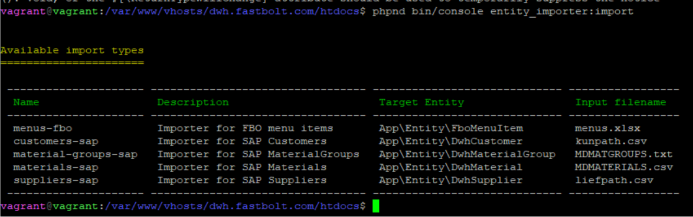

[](https://packagist.org/packages/fastbolt/entity-importer)

[](https://codeclimate.com/github/fastbolt/entity-importer)
[](https://app.codecov.io/gh/fastbolt/entity-importer/)

[](https://shepherd.dev/github/fastbolt/entity-importer)
[](https://shepherd.dev/github/fastbolt/entity-importer)

[](https://github.com/fastbolt/entity-importer/actions)

# Entity importing library

This library aims to provide an easy way to import files into doctrine entities.


## Prerequisites

For now, the bundle is tested using PHP 7.4, 8.0 and 8.1.

Internally, we rely on [PortPHP](https://github.com/portphp) and [Doctrine](https://github.com/doctrine/persistence)

## Installation

The library can be installed via composer:

```
composer require fastbolt/entity-importer
```

## Configuration

If not configured automatically, the bundle needs to be enabled in your project's `bundles.php` file:

```php
<?php

return [
    Fastbolt\EntityImporter\EntityImporterBundle::class => ['all' => true],
];
```

## Implementation

The only necessary code for new importers is the `Fastbolt\EntityImporter\EntityImporterDefinition` implementation. We recommend
extending the abstract `Fastbolt\EntityImporter\AbstractEntityImporterDefinition` class.

Currently, two import sources are available: Csv and Xlsx.

## Usage

After implementing the above interface, the console command `entity_importer:import` will automatically recognize the new implementation.

When executing the command without any arguments, it will display all available implementations:



### Implementation example:

```php
<?php

namespace App\Component\Data\Import\EntityImporter;

use App\Entity\Branch;use App\Entity\Material;use App\Entity\MaterialGroup;use App\Repository\BranchRepository;use App\Repository\MaterialGroupRepository;use App\Repository\MaterialRepository;use DateTime;use Doctrine\Persistence\ObjectRepository;use Fastbolt\EntityImporter\AbstractEntityImporterDefinition;use Fastbolt\EntityImporter\Reader\CsvReader;use Fastbolt\EntityImporter\Types\ImportSourceDefinition\Csv;

/**
 * @template-implements Material
 */
class MaterialImporterDefinition extends AbstractEntityImporterDefinition
{

    /**
     * @var Csv
     */
    private Csv $importSourceDefinition;

    /**
     * @var MaterialRepository
     */
    private MaterialRepository $repository;

    /**
     * @var MaterialGroupRepository
     */
    private MaterialGroupRepository $materialGroupRepository;

    /**
     * @var BranchRepository
     */
    private BranchRepository $branchRepository;

    /**
     * @param MaterialRepository      $repository
     * @param MaterialGroupRepository $materialGroupRepository
     * @param BranchRepository        $branchRepository
     */
    public function __construct(
        MaterialRepository $repository,
        MaterialGroupRepository $materialGroupRepository,
        BranchRepository $branchRepository
    ) {
        $this->repository              = $repository;
        $this->materialGroupRepository = $materialGroupRepository;
        $this->branchRepository        = $branchRepository;

        $this->importSourceDefinition = new Csv('MDMATERIALS.csv', CsvReader::TYPE);
    }

    /**
     * @inheritDoc
     */
    public function getName(): string
    {
        return 'materials';
    }

    /**
     * @inheritDoc
     */
    public function getDescription(): string
    {
        return 'Importer for Materials';
    }

    /**
     * @inheritDoc
     */
    public function getEntityClass(): string
    {
        return Material::class;
    }

    /**
     * @inheritDoc
     */
    public function getIdentifierColumns(): array
    {
        return ['materialNumber', 'branch'];
    }

    /**
     * @inheritDoc
     */
    public function getFields(): array
    {
        return [
            'materialGroup',
            'branch',
            'materialNumber',
            'shortMaterialNumber',
            'purchasingTextDe',
            'purchasingTextEn',
            'priceGroup',
            'priceUnit',
            'packingUnit',
            'weight',
            'purchasingAbcMark',
            'language',
            'availableSince',
            'customsTariffNumber',
            'ean',
            'isOnlineMaterial',
            'rangeIndicator',
        ];
    }

    /**
     * @inheritDoc
     */
    public function getImportSourceDefinition(): Csv
    {
        return $this->importSourceDefinition;
    }

    /**
     * @inheritDoc
     */
    public function getRepository(): ObjectRepository
    {
        return $this->repository;
    }

    /**
     * @inheritDoc
     */
    public function getFieldConverters(): array
    {
        return [
            'branch'         => function ($value): Branch {
                return $this->branchRepository->find($value);
            },
            'materialGroup'  => function ($value): MaterialGroup {
                return $this->materialGroupRepository->findOneBy(['name' => $value]);
            },
            'priceUnit'      => static function ($value): int {
                return (int)trim($value);
            },
            'availableSince' => static function ($value): ?DateTime {
                if ('00000000' === $value) {
                    return null;
                }

                return DateTime::createFromFormat('Ymd', $value);
            },
            'packingUnit'    => static function ($value): int {
                return (int)trim($value);
            },
            'weight'         => static function ($value): float {
                return (float)trim(str_replace(',', '', $value));
            },
        ];
    }

    /**
     * @inheritDoc
     */
    public function getSkippedFields(): array
    {
        return [
            'language',
        ];
    }

    /**
     * @inheritDoc
     */
    public function getEntityModifier(): ?callable
    {
        return static function (Material $material) {
            $material->setIsProtected(true);
        };
    }
}
```
